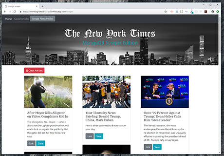

# :newspaper: Mongo-News-Scraper 
A `Node.js` &amp; `MongoDB` webapp that web-scrapes news data from [The New York Times](https://www.nytimes.com/) and allows users to save articles and comment about what they have read.

Check Out the Video Run Through - https://drive.google.com/file/d/1tl8LftROt9wqM32gOJ0oWKJ0y31oe2xH/view

## Functionality
On the backend, the app uses `express` to serve routes and `mongoose` to interact with a `MongoDB` database.

On the frontend, the app uses `handlebars` for templating each article and `materialize` as a styling framework. The app also uses `jQuery` and `AJAX` to help with making post requests.

And for webscraping, the app uses the `request` and `cheerio` node packages. All webscrapping code can be found in the `controllers.js` file.

## Getting Started
Clone the app down to your local machine -
  1. Ensure that you have MongoDB set up on your laptop
    * An amazing repo to get you started with that can be found [here](https://github.com/dannyvassallo/mongo_lesson).
  2. Once you are set up, `cd` into this repo and run `npm install`.
  3. Then open another bash or terminal window and run `mongod`
  4. Run the script with `node server.js`.
  5. Navigate to `localhost:3000` in your browser.

## Screenshots
Home

  

Scraped

  

Saved

  

Notes

   
   
   
Please check out the deployed version in Heroku - https://morning-beach-75560.herokuapp.com/